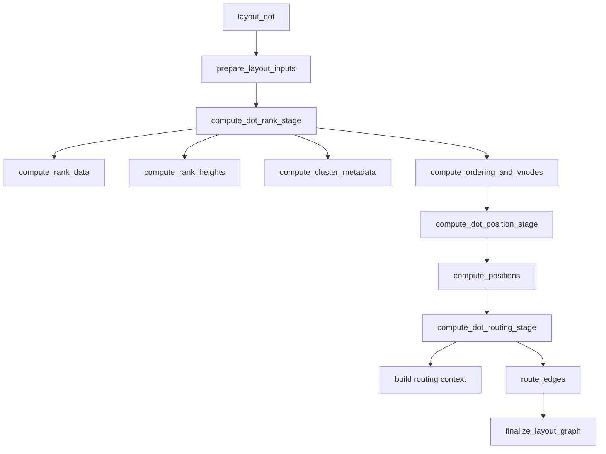
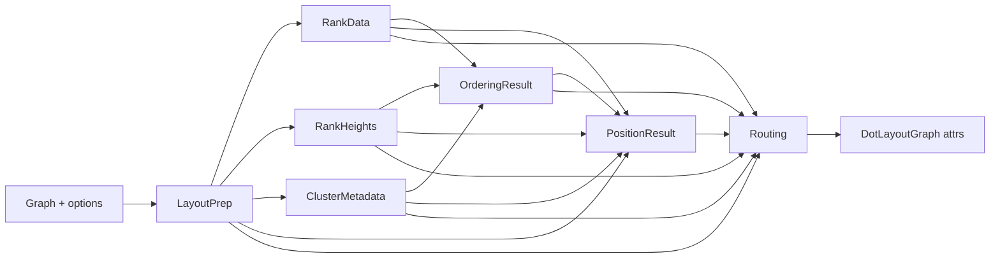
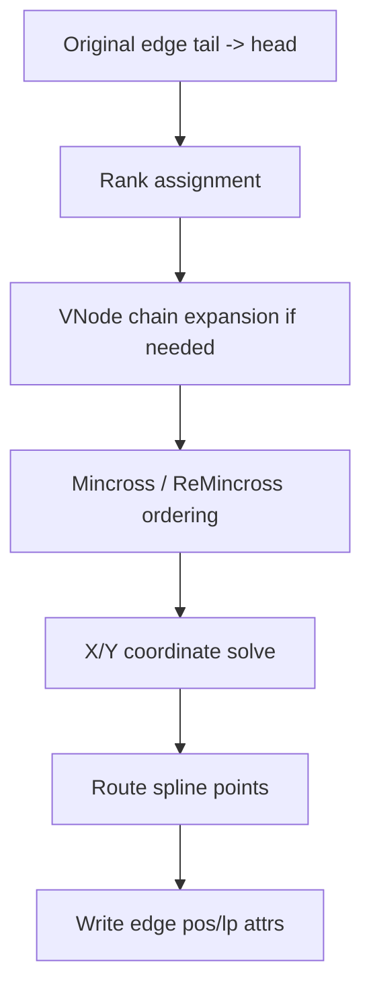

# DOT Layout Algorithm (Beginner-Friendly + Implementation Notes)

This document explains how the `src/layout/dot` package lays out a graph in DOT style.

It is written for readers who may **not** be familiar with graph layout algorithms.

Goals of this document:

- explain **what each stage does**,
- explain **why that stage exists**,
- connect high-level ideas to actual implementation files,
- highlight Graphviz parity constraints used by this repository.

The implementation targets strict output parity with Graphviz `dot` and is validated with byte-level fixtures.

---

## 0) Quick Mental Model

Think of DOT layout like planning a multi-floor transit map:

1. decide which floor each station belongs to (**ranking**),
2. choose left-to-right order on each floor (**ordering / crossing reduction**),
3. assign concrete coordinates (**positioning**),
4. draw routes with good geometry (**routing**),
5. write all results back to graph attributes (**finalization**).

DOT is not one single formula. It is a staged pipeline where each stage solves one subproblem and passes structured data to the next stage.

---

## 1) Basic Terms (for newcomers)

- **Node**: a graph vertex.
- **Edge**: a connection from tail node to head node.
- **Rank**: a layer/level (e.g., top-to-bottom row in TB mode).
- **Cluster**: a grouped subgraph (often rendered as a box around members).
- **VNode (virtual node)**: an internal synthetic node added by the algorithm to make long edges and constraints manageable.
- **Mincross**: crossing-reduction phase that tries to reduce edge crossings by reordering nodes.
- **Class2/XPos**: Graphviz family of x-coordinate constraint logic.

---

## 2) Public Entry and Pipeline Boundary

Primary entry point:

- `layout_dot` in `src/layout/dot/layout.mbt`

High-level call flow:

```text
layout_dot
  -> prepare_layout_inputs
  -> compute_dot_rank_stage
       -> compute_rank_data
       -> compute_rank_heights
       -> compute_cluster_metadata
       -> compute_ordering_and_vnodes
  -> compute_dot_position_stage
       -> compute_positions
  -> compute_dot_routing_stage
       -> build spatial/routing context
       -> route_edges
  -> finalize_layout_graph
```

Pipeline diagram:



Pipeline orchestrator files:

- `src/layout/dot/layout.mbt`
- `src/layout/dot/layout_dot_pipeline.mbt`

Why this design:

- easier debugging (stage-by-stage trace),
- deterministic behavior (typed stage payloads),
- parity-safe refactoring (small, testable stage boundaries).

---

## 3) Core Stage Data Objects

Defined in `src/layout/dot/layout_pipeline_helpers.mbt`.

- `LayoutPrep`
  - normalized options/attrs, node/edge arrays, size/port metadata.
- `RankData`
  - oriented edges, rank map, groups, rank keys/span.
- `RankHeights`
  - per-rank top/bottom half-heights + spacing constants.
- `ClusterMetadata`
  - cluster membership/order/parent/range and related ordering metadata.
- `OrderingResult`
  - final rank ordering (real + vnode variants), order graph artifacts, vnode info.
- `PositionResult`
  - x/y maps for nodes/vnodes + cluster boundary maps.

Why these objects matter:

- each stage consumes an explicit contract,
- reduces hidden coupling,
- makes parity diffs easier to localize.

Data handoff diagram:



---

## 4) Stage A — Input Preparation

Main files:

- `src/layout/dot/layout_pipeline_input_helpers.mbt`
- `src/layout/dot/layout_pipeline_helpers.mbt` (shared structs/utilities)

### What it does

1. Resolve options and graph attributes (`rankdir`, `nodesep`, `ranksep`, `splines`).
2. Validate and clamp spacing values (Graphviz-compatible minima).
3. Collect ordered node/edge arrays.
4. Detect important flags (port edges, dotted edges, edge labels).
5. Compute node sizes and record-port ordering metadata.
6. Build initial deterministic node-order seed.

### Why this stage exists

Later stages assume a clean canonical view of the graph. If option parsing or size derivation happened in many places, behavior would drift and parity would break.

### Principle

**Canonicalize early, reuse everywhere.**

---

## 5) Stage B — Rank Stage

Orchestrator:

- `compute_dot_rank_stage` in `src/layout/dot/layout_dot_pipeline.mbt`

This stage decides vertical layering and ordering inputs.

### B1) Rank assignment + acyclic orientation

Main files:

- `src/layout/dot/layout_pipeline_rank_helpers.mbt`
- `src/layout/dot/rank_assignment.mbt`
- `src/layout/dot/network_simplex/*`
- `src/layout/dot/acyclic_helpers.mbt`

What happens:

- preprocess orientation so ranking can run on a directed structure,
- compute rank index for each node,
- build rank groups and complete rank span,
- keep metadata for self-edge labels.

Why:

You need a layered skeleton first. Without rank assignment, later crossing-reduction and x-coordinate solving are ill-defined.

### B2) Rank heights and y-spacing budgets

What happens:

- initialize per-rank height from node sizes,
- inflate for edge labels and vnode requirements,
- compute final `rank_ht1`, `rank_ht2`, `nodesep_pt`, `ranksep_pt`.

Why:

Ranks are not just integer layers; each layer needs physical height budget so labels and nodes do not overlap.

### B3) Cluster metadata

What happens:

- compute cluster membership (`cluster_keys`),
- build cluster order and parent relation,
- compute cluster rank ranges (`min/max rank`),
- build cluster skeleton metadata,
- collect rank=same and flat-constraint metadata.

Why:

Clusters alter ordering and positioning constraints globally. This metadata is required by ordering, x constraints, and routing.

---

## 6) Stage C — Ordering + VNode Expansion

Entry:

- `compute_ordering_and_vnodes` in `src/layout/dot/layout_pipeline_helpers.mbt`

Supporting files:

- `src/layout/dot/layout_pipeline_stage_c_order_edge_helpers.mbt`
- `src/layout/dot/layout_pipeline_stage_c_order_graph_helpers.mbt`
- `src/layout/dot/layout_pipeline_stage_c_cluster_reorder_helpers.mbt`
- `src/layout/dot/layout_pipeline_stage_c_root_cluster_reorder_helpers.mbt`
- `src/layout/dot/layout_pipeline_stage_c_remincross_*` (Stage C ReMincross family)
- `src/layout/dot/layout_pipeline_helpers.mbt`
- `src/layout/dot/ordering_helpers.mbt`
- `src/layout/dot/mincross.mbt`

This is the most complex stage.

### C1) Build ordering edges

What happens:

- normalize edge endpoints (including virtual-direction mapping),
- expand edge chains through vnodes,
- attach penalty/port-order metadata,
- group by tail and coalesce mergeable entries,
- replay deterministic creation order.

Why:

Crossing-reduction works on an internal “ordering graph”, not directly on original edges.

### C2) Root mincross pass

What happens:

- run median/transpose-style crossing reduction on rank groups.

Why:

Edge crossings strongly affect readability; this pass is the primary crossing minimization pass.

### C3) Cluster-local reorder

What happens:

- for clustered graphs, run local ordering logic in cluster scopes,
- preserve local neighbor/order semantics.

Why:

A global reorder alone can violate cluster-local visual quality.

### C4) Root-cluster reorder

What happens:

- compute cluster rank order at root level,
- project cluster order back into node ordering.

Why:

Needed to keep global cluster arrangement stable and Graphviz-compatible.

### C5) ReMincross pass

What happens:

- rematerialize an ordering graph with cluster/vnode-aware constraints,
- run another crossing-reduction pass.

Why:

The first pass may not capture all clustered/vnode interactions. ReMincross refines ordering under richer constraints.

### C6) Stage output

Produces `OrderingResult` containing:

- `ordered_groups` (real nodes),
- `ordered_groups_with_vnodes`,
- vnode maps (ranks/clusters/chains),
- materialized order-edge arrays and order indices.

Important current behavior:

- `build_rank_same_constraints` currently yields empty constraints by design, matching current parity baseline.
- cluster skeleton nodes are internal helpers and are removed from final visible groups.

---

## 7) Stage D — Position Stage (X then Y)

Entry:

- `compute_positions` in `src/layout/dot/layout_pipeline_helpers.mbt`

### D1) Mode gating

Decides whether to use:

- vnode-aware xpos path,
- optional xpos reorder path.

Why:

Different graphs require different internal paths for parity and stability.

### D2) X-stage seed construction

Builds:

- x groups (with/without vnodes),
- x cluster ownership map,
- edge port-x and port-order arrays.

Why:

X solving is constraint-driven. It needs clean, explicit constraint inputs.

### D3) Optional x reorder + transpose cleanup

What happens:

- apply reorder heuristics (when enabled),
- apply cleanup to remove unstable artifacts.

Why:

Improves crossing/spacing while keeping deterministic behavior.

### D4) X constraint solving

What happens:

- solve x positions with class2/xpos-style constraints,
- include cluster boundary and optional flat-label augmentation constraints.

Why:

Transforms relative ordering rules into concrete x coordinates.

### D5) Y projection and output maps

What happens:

- map ranks to y coordinates via rank heights,
- produce real/vnode positions,
- derive cluster left/right boundary x maps and cluster bbox height metadata.

Why:

Final geometry needs both coordinates and cluster envelope data for routing/finalization.

---

## 8) Stage E — Routing Stage

Entry:

- `compute_dot_routing_stage` in `src/layout/dot/layout_dot_pipeline.mbt`

Main files:

- `src/layout/dot/layout_routing_helpers.mbt`
- `src/layout/dot/routesplines/*`
- `src/layout/dot/pathplan/*`
- `src/layout/dot/edge_spline/*`

### What it does

1. Build final node geometry and port maps from positioned nodes.
2. Compute cluster bounding boxes for obstacle/context routing.
3. Apply optional `ratio/fill` scaling workflow.
4. Build routing context (groups, ranks, vnode positions, bboxes, ports).
5. Route each edge according to splines mode.
6. Emit spline control points and label positions.

### Why routing is separate from positioning

Positioning tells “where nodes are.” Routing solves “how edges travel between them” while honoring ports, labels, clusters, and shape clipping.

---

## 9) Stage F — Finalization / Attribute Writeback

Main file:

- `src/layout/dot/layout_postprocess_helpers.mbt`

What is written:

- graph/subgraph `bb`, label metrics,
- node `pos`, `width`, `height`, record `rects`, label/xlabel positions,
- edge `pos` (spline encoding) + label positions (`lp`, `head_lp`, `tail_lp`, `xlp`).

Why:

DOT layout API returns geometry, but users/renderers consume attributes on graph/node/edge objects.

---

## 10) Special Topics (Beginners Usually Ask)

### 10.1 Why virtual nodes?

Long edges that cross many ranks are hard to optimize directly. Splitting them into rank-by-rank segments via vnodes makes ordering and crossing logic tractable.

### 10.2 Why multiple crossing-reduction passes?

Cluster constraints and vnode expansions can change crossing behavior after initial ordering. A later pass (ReMincross) refines ordering under the full constraint set.

### 10.3 Why so many maps and arrays?

Graphviz-compatible behavior is highly order-sensitive. Explicit maps/arrays preserve exact edge/node iteration semantics required for strict parity.

### 10.4 Why are there many helper files?

The algorithm is complex. Splitting by responsibility (input, rank, order-edge, order-graph, cluster-local reorder, root-cluster reorder, routing) improves maintainability while keeping behavior unchanged.

### 10.5 What happens to a single long edge?

For beginners, this is often the hardest part. A long edge is not routed “as-is” immediately.

Typical journey:

1. rank stage decides endpoint ranks,
2. ordering stage may expand the edge into vnode chain segments,
3. mincross/remincross reorders ranks to reduce crossings,
4. position stage assigns x/y to endpoints and vnodes,
5. routing stage converts that geometry into spline control points.



This is why long edges can still look smooth and consistent even when they span many layers and clusters.

---

## 11) Determinism, Debugging, and Parity

Determinism rules:

- preserve creation-order semantics,
- keep stage argument wiring explicit,
- avoid hidden order dependence from unordered traversals.

Useful debug env flags:

- `DOT_TRACE`
- `DOT_TRACE_GROUPS`
- `DOT_TRACE_POS`
- `DOT_TRACE_EDGES`
- `DOT_TRACE_ROUTE`
- `DOT_TRACE_REMINCROSS_INPUT`
- `DOT_CAPTURE_ORDERING_INPUTS`
- `DOT_CAPTURE_ORDERING_FIXTURE_MODE`

Repository guard validates:

- strict output parity (`dot` / `xdot` / `svg`),
- invariance when ordering-input capture mode is enabled.

---

## 12) Source Map by Responsibility

- Entry + stage orchestration:
  - `layout.mbt`, `layout_dot_pipeline.mbt`
- Input canonicalization:
  - `layout_pipeline_input_helpers.mbt`
- Rank assignment and rank heights:
  - `layout_pipeline_rank_helpers.mbt`, `rank_assignment.mbt`, `network_simplex/*`
- Ordering dispatch + shared stage logic:
  - `layout_pipeline_helpers.mbt`
- Ordering edge materialization:
  - `layout_pipeline_stage_c_order_edge_helpers.mbt`
- Ordering graph construction helpers:
  - `layout_pipeline_stage_c_order_graph_helpers.mbt`
- Cluster-local reorder:
  - `layout_pipeline_stage_c_cluster_reorder_helpers.mbt`
- Root-cluster reorder and cluster-rank-order logic:
  - `layout_pipeline_stage_c_root_cluster_reorder_helpers.mbt`
- Stage C ReMincross refinement family:
  - `layout_pipeline_stage_c_remincross_reorder_execute_helpers.mbt`
  - `layout_pipeline_stage_c_remincross_reorder_input_helpers.mbt`
  - `layout_pipeline_stage_c_remincross_clustered_*`
  - `layout_pipeline_stage_c_remincross_nlist_order_helpers.mbt`
  - `layout_pipeline_stage_c_remincross_cluster_tail_order_helpers.mbt`
  - `layout_pipeline_stage_c_remincross_trace_helpers.mbt`
- X-position internals and crossing helpers:
  - `xpos.mbt`, `ordering_helpers.mbt`, `mincross.mbt`
- Routing:
  - `layout_routing_helpers.mbt`, `routesplines/*`, `pathplan/*`, `edge_spline/*`
- Final graph writeback:
  - `layout_postprocess_helpers.mbt`

---

## 13) Recommended Reading Order (New Contributors)

If you are new to layout algorithms, read in this order:

1. `layout.mbt` (`layout_dot`) — understand end-to-end call sequence.
2. `layout_dot_pipeline.mbt` — understand stage boundaries.
3. `layout_pipeline_input_helpers.mbt` — understand canonical input formation.
4. `layout_pipeline_rank_helpers.mbt` — understand rank and spacing foundations.
5. `layout_pipeline_stage_c_order_edge_helpers.mbt` + `layout_pipeline_stage_c_order_graph_helpers.mbt` — understand order graph construction.
6. `layout_pipeline_stage_c_cluster_reorder_helpers.mbt` + `layout_pipeline_stage_c_root_cluster_reorder_helpers.mbt` + `layout_pipeline_stage_c_remincross_*` — understand clustered reorder/refinement.
7. `layout_pipeline_helpers.mbt` — understand orchestration glue and position stage internals.
8. `layout_routing_helpers.mbt` — understand edge geometry generation.
9. `layout_postprocess_helpers.mbt` — understand output attribute mapping.

This order follows data flow and keeps the learning curve manageable.
